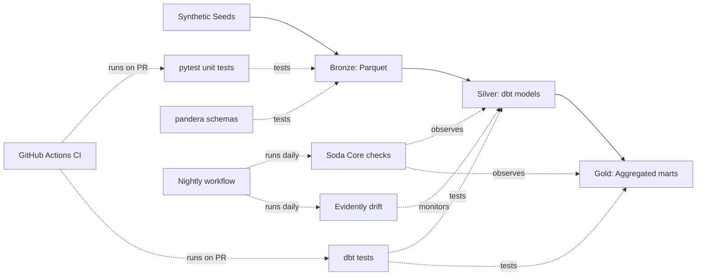

# Week 15 — End-to-End Capstone Project | Training Materials

> **Companion to:** Week 15 of the *Data Automation Testing* study plan
> **Time budget:** 8–12 hours across 5 days — likely the heaviest week of the curriculum
> **Goal:** Build (or polish) a complete, production-style data testing project that demonstrates everything from Weeks 1–14. By Friday you have a portfolio-grade GitHub repo a hiring manager can read in 10 minutes and learn enough to want a 60-minute conversation.
>
> **This week is different.** The previous 14 weeks introduced new tooling and concepts daily. Capstone week introduces nothing new — it asks you to **synthesize, polish, and present**. Less reading, more building. Less typing in a tutorial, more decisions about what to keep and what to cut.

---

## How to use this file

- This week is deliverable-focused. Each day has a **concrete output** — not a theory section + exercises.
- Each day has a "Done when..." checklist. Treat it as a definition-of-done, not a wishlist.
- A common pitfalls section appears mid-week to catch the trip-up patterns
- The Friday section is documentation, not the usual AI workflow — that returns in Week 16
- Answers section at the end has different content this week — a portfolio review checklist instead of self-check answers

---

## A decision to make first (~10 minutes)

The original plan recommends starting from a public dataset (NYC Taxi, Chicago Food Inspections, UCI ML). You have two reasonable paths:

### Path A — Polish the cumulative e-commerce project (recommended if time-pressed)

You've been building this across 14 weeks. It already has SQL tests, pandera schemas, a dbt project, GX checkpoints, CI workflow, factory fixtures, drift baselines. **The 80% lift here is making it presentable, not building more.**

**Pros**: 14 weeks of accumulated work; concepts are deeply familiar; you can polish to a higher standard with available time.
**Cons**: synthetic data; doesn't demonstrate "I can land in a new domain and ship."

### Path B — New public-dataset project (recommended if you want maximum portfolio impact)

Pick NYC Taxi (best default — large, partitioned Parquet, real quality issues, well-documented), Chicago Food Inspections (good if you want JSON-heavy work to mirror Week 9), or a UCI ML dataset (only if you want the ML layer to dominate).

**Pros**: real data with real quality issues; demonstrates "I can ramp on a new domain"; a hiring manager who knows the dataset can spot whether you actually engaged with the data.
**Cons**: starting from scratch; 14 weeks of code becomes "supporting material" rather than the centerpiece.

### Path C (the actually-best option, if you have the time) — Both

Polish the e-commerce project as the primary portfolio piece, *and* spend Days 2–3 building a small taxi-data layer that shows you can apply the patterns to a fresh dataset. Two repos, cross-linked.

### How to decide

Ask yourself: in a 30-minute interview where you have to walk through one project, which would you rather show? Whichever answer comes first, that's your primary. If you have 12+ hours this week, do Path C; if 8, pick A or B.

This file mostly assumes Path A or C. If you went pure Path B, the daily deliverables map cleanly — just substitute "taxi data" for "e-commerce" throughout.

---

## Day 1 (Mon) — Project Setup & Audit

### Goal

Inventory what you have. Decide what stays, what's removed, what needs polish. End the day with a clean repo structure and a written **gap list** of what's still needed.

### What to do

**Step 1 — Inventory your existing code (~30 min)**

Walk through your repo. For each file/directory, mark it as:

- ✅ **Keep as-is** — clean, recent, working
- 🟡 **Polish** — works but rough (no docstrings, magic numbers, unused imports, outdated patterns)
- 🔴 **Rewrite** — broken or no longer aligned with current best practices
- ❌ **Delete** — exploratory code, dead branches, leftover scratchwork

Most projects after 14 weeks have ~20% files in the 🟡/🔴 category. Confronting that is the point of Day 1.

**Step 2 — Settle on a target architecture diagram (~30 min)**

Before writing more code, draw the picture you'll put in your README. A bad version is fine for now — refine it Friday. Sketch:
- Source layer (raw CSV / JSON / Parquet inputs)
- Bronze layer (raw ingestion as Delta or Parquet)
- Silver layer (cleaned, validated, dbt models)
- Gold layer (aggregated marts)
- Test/quality layer (where each test category lives — overlaid on the data layers)
- CI/CD layer (where GitHub Actions run, what they trigger)
- Monitoring layer (where Soda / Evidently checks run, where alerts go)

This is the diagram every interviewer will ask you to walk through. Better to commit to it now and iterate.

**Step 3 — Reorganize the repo to a clean structure**

A target layout for a polished portfolio project:

```
data-testing-capstone/
├── README.md                      # Day 5 deliverable
├── architecture.md                # detailed walkthrough
├── pyproject.toml                 # or requirements.txt
├── .github/workflows/             # Week 7 CI workflows
│   ├── pytest.yml
│   ├── dbt.yml
│   └── nightly_volume.yml
├── data/                          # small sample data; large data downloaded by script
│   ├── seeds/                     # generators (Week 8 seed_data.py lives here)
│   └── samples/                   # 100-row samples for repo demo
├── pipelines/                     # raw → bronze → silver
│   ├── ingest.py                  # raw → bronze
│   └── transform.py               # any non-dbt transformations
├── ecom_dbt/                      # Week 6 dbt project
│   ├── dbt_project.yml
│   ├── models/
│   ├── tests/
│   └── seeds/
├── gx_project/                    # Week 5 Great Expectations
├── soda/                          # Week 13 Soda checks
│   ├── configuration.yml
│   └── checks/
├── ml/                            # Week 14 ML testing
│   └── drift_monitor.py
├── tests/                         # pytest tests
│   ├── conftest.py
│   ├── factories/                 # Week 8 factories
│   ├── unit/
│   ├── integration/
│   └── volume/                    # marked @pytest.mark.volume
├── airflow/                       # Week 13 (if you set up Airflow)
│   └── dags/
├── notebooks/                     # exploratory; explicitly NOT in portfolio path
│   └── README.md                  # explain these are scratch
└── docs/
    ├── architecture_diagram.png
    └── test_coverage_summary.md
```

Adapt to your actual layout — the principle is "every top-level item answers a question about the project." A reviewer landing on the README and clicking around should not be confused.

**Step 4 — Write the gap list**

In `notes.md` or a GitHub Project, list everything you know is missing. Examples from real capstones:

- "GX checkpoint runs locally but not in CI"
- "dbt tests pass but no source freshness check on the seed table"
- "Soda checks file exists but never been run end-to-end"
- "No README; existing README is one paragraph from Week 1"
- "Reconciliation rule (orders.total = SUM(items)) tested 4 times but inconsistently"

This list drives the next 4 days.

### Common decisions to make today

- **Stop touching the synthetic data.** The data you've been seeding for 14 weeks is the data. Lock the seed (`seed_data.py` from Week 2). Re-running should produce identical files. If it doesn't, your seed isn't deterministic — fix that today, before adding more dependencies.
- **Pick a single naming convention.** Are tables `customers` or `customer`? `total_amount` or `total`? Pick one. Mismatches confuse readers and hide bugs.
- **Decide what's optional.** Path A might include "I'd like to add Iceberg support but can't justify it given the time budget." Write that down explicitly. Optional features should be in the gap list with a "won't do this week" note.

### Done when...

- [ ] You have a target directory structure your repo matches
- [ ] You have an architecture diagram (rough is fine for now)
- [ ] You have a written gap list with at least 10 items
- [ ] You've removed dead code, scratchwork, and unused branches
- [ ] Your `requirements.txt` or `pyproject.toml` is clean (no leftover packages from experiments)
- [ ] Your `.gitignore` excludes the right things (no `.duckdb`, no `__pycache__`, no `.env`)

---

## Day 2 (Tue) — Build / Polish the Pipeline

### Goal

Production-style **Bronze → Silver → Gold pipeline** running locally end-to-end with a single command. By the end of today, `make pipeline` (or `python -m pipelines.run` or whatever you choose) executes the full flow start-to-finish.

### What to do

**Step 1 — Decide on a pipeline orchestration entrypoint (~15 min)**

Three pragmatic options:

1. **A `Makefile`** — simplest, portable, no Python dependencies. Good for "small ops" repos.
2. **A `run.py` script** — Python-native, easy to extend, no extra tooling.
3. **An Airflow DAG** — most production-realistic, but Airflow setup is itself a project.

Pick one and commit. For a portfolio project, options 1 or 2 are usually right — Airflow adds friction for reviewers who can't run it without Docker. Mention Airflow in your README as the "production deployment target" without requiring it to run locally.

**A simple `Makefile` example**:

```makefile
.PHONY: help seed bronze silver gold test ci all clean

help:
	@echo "make seed     - regenerate sample data from seeds"
	@echo "make bronze   - load raw data into Bronze (Delta) layer"
	@echo "make silver   - run dbt models for Silver layer"
	@echo "make gold     - run dbt models for Gold (mart) layer"
	@echo "make test     - run pytest + dbt tests + Soda checks"
	@echo "make ci       - what CI runs"
	@echo "make all      - end-to-end pipeline + tests"

seed:
	python -m data.seeds.generate

bronze:
	python -m pipelines.ingest

silver:
	cd ecom_dbt && dbt build --models tag:silver

gold:
	cd ecom_dbt && dbt build --models tag:gold

test:
	pytest tests/ -v
	cd ecom_dbt && dbt test
	soda scan -d ecom -c soda/configuration.yml soda/checks/*.yml

ci: test

all: seed bronze silver gold test
	@echo "Pipeline complete. Run 'make report' to view drift dashboard."

clean:
	rm -rf data/bronze/*.delta data/warehouse.duckdb
	cd ecom_dbt && dbt clean
```

**Step 2 — Wire up the layers cleanly**

For each layer, confirm:

- **Bronze** ingests from a source path (CSV / JSON / Parquet) and writes to a known location. Use the Week 11 patterns (Delta or Iceberg) if you set them up; otherwise plain Parquet is fine — note "Bronze is Parquet for simplicity; would be Delta in production" in your README.
- **Silver** is your dbt staging models from Week 6. They reference Bronze, apply Week 4's quality rules, and produce cleaned, well-typed tables.
- **Gold** is your dbt mart models — aggregations, business logic, what consumers use.

**Step 3 — Add at least one production-realistic feature** that goes beyond the tutorials:

- **Idempotent reruns** — running the pipeline twice produces the same output, not duplicates. Use `MERGE` (Week 11) or dbt incremental models with proper `unique_key`.
- **Failure isolation** — if one Silver model fails, others continue (or fail explicitly with a clear error).
- **Logging** — structured logs at each step. `print` is fine; `logging` module is better; structured JSON logs are best.
- **Configurable** — pipeline accepts a date range or "small/full" flag, not hardcoded paths.

Pick **one** and implement it well, rather than half-implementing all four.

**Step 4 — Run the pipeline end-to-end**

Delete all generated artifacts (`make clean`). Run `make all`. Time it. Note: pipeline runtime, peak memory, output sizes. These numbers go in the README.

### Done when...

- [ ] One command runs the full pipeline end-to-end (start from clean slate)
- [ ] Bronze, Silver, Gold layers are all populated correctly
- [ ] At least one production-realistic feature beyond tutorials (idempotency / logging / config / etc.)
- [ ] Reruning the pipeline produces identical output (idempotency check)
- [ ] You've recorded the pipeline runtime and output sizes
- [ ] No hardcoded absolute paths in the code (use `pathlib`, env vars, or config)

---

## Day 3 (Wed) — Tests at All Layers

### Goal

Comprehensive test coverage with **25+ named assertions** spanning unit, integration, schema, business-rule, and observability checks. Every layer of the architecture diagram has at least one test.

### What to do

**Step 1 — Inventory your existing tests**

For each test category, count what you have:

| Category | Tool | Where | Target |
|---|---|---|---|
| Unit tests on transformation functions | pytest | `tests/unit/` | 5+ |
| Schema validation | pandera or Great Expectations | `tests/integration/` or `gx_project/` | 3+ |
| dbt generic tests (unique, not_null, accepted_values, relationships) | dbt | `ecom_dbt/models/schema.yml` | 8+ |
| dbt singular tests (custom SQL) | dbt | `ecom_dbt/tests/` | 2+ |
| Cross-table reconciliation (Week 1 rule) | dbt or Soda or pytest | wherever it lives | 1+ |
| Soda Core data quality checks | Soda | `soda/checks/` | 5+ |
| Source freshness | dbt | `ecom_dbt/models/sources.yml` | 1+ |
| Volume / load test (marked, not run on PR) | pytest-benchmark | `tests/volume/` | 1+ |
| Drift baseline | Evidently | `ml/drift_monitor.py` | 1+ |

That's a target of 27+ assertions across categories. Yours may differ; the structure is the point.

**Step 2 — Fill gaps**

Pick the categories where you're below target. Common gaps:

- **Volume / scale tests** are usually missing — most learners stop at unit tests
- **Reconciliation tests** are usually inconsistent across tools (the Week 1 rule appears in 4 places, with slightly different tolerances)
- **Source freshness** is usually undefined for seed-based projects (it doesn't quite apply); document this in your README
- **Drift baseline** often skipped because "the data is synthetic" — fine; document the limitation

**Step 3 — Eliminate duplicate tests across tools**

The "test the same thing in 3 places" anti-pattern from Week 13: pick one tool per concern. If `orders.customer_email IS NOT NULL` is checked in pandera AND dbt AND Soda, pick one and remove the others. Keep a brief table in `docs/test_coverage_summary.md`:

```markdown
## Test Coverage Map

| Concern | Where it's tested | Why there |
|---|---|---|
| Customer email is non-null | dbt (`models/schema.yml`) | Lives with the model definition; dbt enforces it on every build |
| Order total reconciles with sum of items | dbt singular test (`tests/order_reconciliation.sql`) | SQL is the natural language for this rule |
| Schema doesn't drift unexpectedly | Soda (`soda/checks/schema.yml`) | Soda runs on production schedule, not just at build time |
| Daily volume within historical range | Soda (`soda/checks/volume.yml`) | Production observability, not pre-deploy testing |
| Pipeline output schema matches expectation | pandera (`pipelines/transform.py`) | Inline in transformation code; catches in development |
```

This document is **gold for interviews.** Reviewers know that "I tested it in 3 places, just to be safe" is a common student mistake. Showing you made deliberate choices is senior-engineer thinking.

**Step 4 — Run all tests**

Delete artifacts; rerun pipeline; run all tests:

```bash
make clean
make all     # runs pipeline + tests
```

Everything should pass. If anything fails, fix it now. Tests that "usually pass but sometimes fail" are not portfolio-quality.

### Done when...

- [ ] At least 25 named test assertions exist across the project
- [ ] Every layer of your architecture diagram has at least one test
- [ ] No duplicate tests across tools (one home per concern; documented)
- [ ] `docs/test_coverage_summary.md` exists and is accurate
- [ ] All tests pass on a fresh `make all` run
- [ ] At least one volume test exists (marked `@pytest.mark.volume`)

---

## ⚠️ Common Capstone Pitfalls (Mid-week reality check)

By Wednesday evening, here's where most capstone projects go sideways. Walk through this checklist:

### 1. "Demo mode" vs reality

Your project runs perfectly when YOU run it. A reviewer cloning fresh — Python version mismatch, missing env var, hardcoded path. Test by **running on a fresh checkout in a new directory tomorrow morning**. If it doesn't work, your README has gaps.

### 2. Synthetic data hiding problems

You seeded the bugs. You know they're there. Your tests catch them. But are the *tests* checking what you say they check, or are they overfit to the specific seeded bugs? Consider seeding a *new* bug your tests haven't seen — does anything fail? If not, your tests aren't as comprehensive as they look.

### 3. The README that says nothing

A 200-line README with installation instructions and a screenshot is not what reviewers want. They want to know: *what problem are you solving, and what design decisions did you make?* A good README is half decisions, half running instructions. If your README has zero "I chose X because Y" sentences, it's incomplete.

### 4. Architecture diagram-to-code mismatch

Your diagram shows a Bronze layer in Delta. Your code uses Parquet. Your diagram shows Airflow. You're using a Makefile. Reviewers spot these in 30 seconds. Either update the diagram or update the code — diverging is worse than either honest version.

### 5. "Should I add X?" syndrome

By Day 3 you've thought about adding: Iceberg, Spark, a real Airflow deployment, more ML models, Datadog alerting, Snowflake support. **Stop.** Each addition is 4–8 hours and most aren't worth it for portfolio purposes. Add to the gap list as "future work."

### 6. Tests that test the wrong thing

A common pattern: a test asserting `assert df is not None` after loading a CSV. Technically a test; doesn't catch any real failure. Walk through every assertion: does it catch a specific failure mode you can describe? If not, replace or delete.

### 7. The "I'll polish it Friday" trap

Polish takes longer than you think. README writing, architecture diagrams, video walkthroughs (if you do one), final test runs — each easily eats 2 hours. **Start polish on Thursday, not Friday morning.**

---

## Day 4 (Thu) — CI/CD, Monitoring & ML Integration

### Goal

Wire up the production-style operational layer: CI runs on every PR, observability checks run on a schedule, ML drift baseline exists. End the day with a green CI badge in the README and a Slack-or-equivalent alert demo.

### What to do

**Step 1 — Verify your CI workflow runs on every PR (~30 min)**

Open a small PR (a typo fix in the README is enough). Watch CI run. Confirm:

- pytest workflow runs and passes
- dbt workflow runs and passes
- Both block merge until green (branch protection from Week 7)
- Total CI time < 5 minutes (if longer, identify the slow step)

If anything fails, this is your priority for the day. CI failing intermittently or running slow makes the whole project look amateur.

**Step 2 — Add a nightly volume / observability workflow (~1 hour)**

A separate workflow that runs on a schedule:

```yaml
# .github/workflows/nightly_observability.yml
name: nightly observability

on:
  schedule:
    - cron: '0 2 * * *'    # 2 AM UTC daily
  workflow_dispatch:

jobs:
  observability:
    runs-on: ubuntu-latest
    steps:
      - uses: actions/checkout@v5
      - uses: actions/setup-python@v5
        with:
          python-version: '3.12'
          cache: 'pip'
      - run: pip install -r requirements.txt
      - run: make seed bronze silver gold
      - run: pytest tests/volume/ -v
      - run: soda scan -d ecom -c soda/configuration.yml soda/checks/*.yml
      - run: python ml/drift_monitor.py
```

This isn't expected to run on real schedule for a capstone — but the workflow file existing demonstrates you understand the production pattern.

**Step 3 — Add an Evidently drift check on a feature column (~1 hour)**

Pick one numerical column from your e-commerce data (`total_amount` is a good choice). Generate two batches: a "reference" batch (your seeded baseline) and a "current" batch (slightly modified — say, multiplied by 1.1).

```python
# ml/drift_monitor.py
import pandas as pd
from evidently import Report
from evidently.presets import DataDriftPreset


def run_drift_check(reference_path: str, current_path: str, output_path: str) -> dict:
    reference = pd.read_parquet(reference_path)
    current = pd.read_parquet(current_path)

    report = Report(
        [DataDriftPreset(method="psi")],
        include_tests=True,
    )
    result = report.run(current_data=current, reference_data=reference)
    result.save_html(output_path)
    return result.dict()


if __name__ == "__main__":
    result = run_drift_check(
        reference_path="data/silver/orders_reference.parquet",
        current_path="data/silver/orders_current.parquet",
        output_path="ml/drift_report.html",
    )
    failed_tests = [t for t in result.get("tests", []) if t.get("status") == "FAIL"]
    if failed_tests:
        print(f"Drift detected: {len(failed_tests)} failed tests")
        for t in failed_tests[:5]:
            print(f"  - {t['name']}: {t.get('description', '')}")
        exit(1)
    else:
        print("No drift detected")
```

The HTML report is what reviewers will open. Save it under `ml/drift_report.html` in the repo so they can click it without running anything.

**Step 4 — Add an alerting hook (Slack or print-to-console)**

For a portfolio project, you don't need a real Slack workspace. Show the *pattern*:

```python
# ml/alerting.py
import os
import requests


def post_alert(severity: str, message: str) -> None:
    """Post alert to Slack if configured; print to stdout otherwise."""
    webhook = os.environ.get("SLACK_WEBHOOK_URL")
    icon = {"page": "🚨", "notify": "⚠️", "log": "ℹ️"}.get(severity, "•")
    formatted = f"{icon} [{severity.upper()}] {message}"

    if webhook:
        try:
            requests.post(webhook, json={"text": formatted}, timeout=5)
            return
        except Exception as e:
            print(f"Failed to post to Slack: {e}")

    # Fallback: print to stdout
    print(formatted)
```

Document this in your README: "Set `SLACK_WEBHOOK_URL` env var to enable Slack alerts; falls back to stdout otherwise." This is the pattern real teams use; showing it without requiring credentials is graceful.

**Step 5 — Verify it all runs together**

```bash
make clean
make all
python ml/drift_monitor.py
```

Three artifacts should exist:
- `ml/drift_report.html` (open it in browser)
- A green CI badge from your last successful workflow run
- A test coverage summary (`docs/test_coverage_summary.md` from Day 3)

### Done when...

- [ ] CI runs on every PR; passes; runs in < 5 minutes
- [ ] Branch protection requires CI to pass (no merge with red checks)
- [ ] A nightly observability workflow exists (even if you never let it run)
- [ ] Evidently drift report saves to `ml/drift_report.html`; opening it shows real visualizations
- [ ] Alert function works end-to-end (with or without Slack); falls back gracefully
- [ ] Your README has a CI badge that goes green

---

## Day 5 (Fri) — Documentation & Polish

### Goal

Make the project legible to a senior engineer in 10 minutes. Three documents matter: **README** (the lobby), **architecture.md** (the technical walkthrough), **test_coverage_summary.md** (the receipts). Plus one final end-to-end test.

### What to do

**Step 1 — Write the README (~2 hours; this is the centerpiece)**

A portfolio README should answer these questions, in order, in under 5 minutes of reading:

1. **What is this?** (1–2 sentences. The problem you're solving + the artifact's nature.)
2. **What does it demonstrate?** (Bullet list. Use the Week 1–14 topics as a checklist.)
3. **What's the architecture?** (Embedded image. The diagram from Day 1, polished.)
4. **How do I run it?** (`make all` is what they want; full instructions for fresh-clone setup.)
5. **What design decisions did you make?** (3–5 short sections explaining trade-offs you considered.)
6. **What's next? / Known gaps** (The honest gap list; demonstrates self-awareness.)

A template skeleton:

```markdown
# Data Quality Testing — End-to-End Capstone

[](https://github.com/USERNAME/REPO/actions/workflows/pytest.yml)

A production-style data quality testing project demonstrating Bronze/Silver/Gold lakehouse architecture with comprehensive test coverage at every layer. Built to consolidate skills from a 16-week intensive learning path covering SQL, Python, dbt, Great Expectations, CI/CD, observability, and ML testing fundamentals.

## What this demonstrates

- **Data quality at every layer** — schema validation, business rules, reconciliation, drift
- **Multiple testing tools, deliberately chosen** — pandera (in-pipeline), dbt tests (transformations), Soda Core (production observability), Evidently (drift)
- **CI/CD pipeline** — GitHub Actions with pytest + dbt + Soda, branch protection
- **Production-realistic features** — idempotent reruns, structured logging, configurable date ranges
- **Honest scope** — synthetic e-commerce data, single-machine deployment; documented limitations vs production

## Architecture


The pipeline ingests synthetic e-commerce data through three layers:
- **Bronze** — raw payloads from `data/seeds/` written to Parquet (would be Delta in production)
- **Silver** — cleaned, validated, type-coerced via dbt
- **Gold** — business-aggregated marts: revenue by country, daily order volume

## Running locally

Requires Python 3.12+. (Tested on macOS 14.x and Ubuntu 24.04.)

```bash
git clone https://github.com/USERNAME/REPO
cd REPO
python -m venv .venv && source .venv/bin/activate
pip install -r requirements.txt
make all          # full pipeline + tests; takes ~3 minutes
```

To regenerate the drift report:
```bash
python ml/drift_monitor.py
open ml/drift_report.html
```

## Design decisions

### Why DuckDB instead of Snowflake / BigQuery?
The e-commerce dataset is synthetic and small; DuckDB runs the entire pipeline in seconds without cloud setup. The dbt project would migrate to Snowflake by changing `profiles.yml` — same models, same tests. For a 100GB+ workload, the trade-off shifts.

### Why Parquet for Bronze instead of Delta Lake?
Pure Python reproducibility. The `deltalake` library has a steeper install path; Parquet works with `pandas.to_parquet`. Production deployments would use Delta or Iceberg for ACID and time travel — the data layer is interchangeable.

### Why one home per testing concern?
Avoid the "test in 3 places" anti-pattern. See `docs/test_coverage_summary.md` for the explicit mapping of concerns to tools.

### Why no Airflow in the local setup?
Airflow setup is itself a project; running locally requires Docker. The DAG file (`airflow/dags/ecom.py`) shows what production deployment would look like, without making the local demo unnecessarily heavy.

## Known limitations / future work

- Synthetic data only — no real production-scale messiness
- Single-machine; no distributed execution patterns
- No real Slack webhook integration (alerting falls back to stdout)
- Iceberg/Hudi support not implemented (would require additional adapters)
- ML testing demonstrates drift detection on one column; a real ML system would have multiple models and broader coverage

## Project structure

```
[repo tree from Day 1, cleaned up]
```

## Acknowledgments

Built as a capstone for [link to learning plan]. Concepts and patterns drawn from the listed tools' official documentation; opinions about trade-offs are my own.
```

This is ~250 lines. **A README isn't documentation; it's the cover letter.** Write it well.

**Step 2 — Polish the architecture diagram (~1 hour)**

Day 1's diagram was rough. Today it's the centerpiece of your README. Tools that work:

- **draw.io / diagrams.net** — free; outputs PNG/SVG; good defaults
- **Excalidraw** — hand-drawn aesthetic; very fast for first drafts
- **Mermaid** — code-based; renders in GitHub natively (no image upload needed)

Mermaid is the lowest-friction option for a GitHub README. A quick example:



Render in any Mermaid viewer; commit the source. GitHub renders it natively.

**Step 3 — Write `architecture.md` (~1 hour)**

A longer technical walkthrough for reviewers who want detail. Cover:

- Detailed data flow per layer (what columns, what transformations, what types)
- Test strategy: which test categories live where, with examples
- CI/CD walkthrough: trigger types, what each workflow does, branch protection
- Observability: which checks run when, where alerts go
- ML testing: drift baseline, future model layer plans

This is the document that answers "tell me how this works" in an interview, in writing. ~500–1000 words is plenty.

**Step 4 — Final fresh-clone test (~30 min)**

```bash
cd /tmp
git clone YOUR_REPO_URL fresh-test
cd fresh-test
python -m venv .venv && source .venv/bin/activate
pip install -r requirements.txt
make all
python ml/drift_monitor.py
```

If everything works without modification, you're done. If something fails, fix it now — this is exactly what a hiring manager will do.

**Step 5 — Optional: Record a 5-minute walkthrough video**

For senior portfolio polish, record a 5-minute Loom (or any screen recorder) walking through:
- The README (1 minute)
- The architecture diagram and key design decisions (2 minutes)
- One test failing intentionally and the alert pattern (2 minutes)

This is hugely effective. Most candidates don't do it. The ones who do stand out.

### Done when...

- [ ] README is polished, ~250 lines, answers the 6 key questions
- [ ] Architecture diagram is in the README and accurate
- [ ] `architecture.md` exists with detailed technical walkthrough
- [ ] `docs/test_coverage_summary.md` is up to date
- [ ] Fresh-clone test passes — `git clone` + `make all` works without modification
- [ ] CI badge is green
- [ ] All known gaps are documented in README's "Known limitations" section

---

## Capstone Quality Bar — The Hiring Manager Test

Before declaring the capstone done, run through this checklist as if you were a senior engineer reviewing the project for a 30-minute interview slot.

### Read-time tests (10 minutes)

- [ ] **README opens with a clear sentence** of what the project is, in plain English
- [ ] **Architecture diagram shows the data flow** with test/CI overlays
- [ ] **Design decisions are visible** — at least 3 "I chose X because Y" explanations
- [ ] **Honest limitations** — what the project doesn't do is documented
- [ ] **Run instructions work on first try** in a fresh clone

### Click-around tests (15 minutes)

- [ ] **Every top-level directory makes sense** — each answers a question about the project
- [ ] **Test coverage summary explains where each concern is tested**, deliberately
- [ ] **CI workflow files are clean** — no commented-out experiments, sensible step naming
- [ ] **dbt project compiles** without warnings; tests pass
- [ ] **No commented-out blocks** in main code paths (if it's not used, delete it)
- [ ] **Imports are clean** — no unused; alphabetized or stdlib-then-third-party

### "Walk me through it" tests (questions you should answer fluently)

- [ ] *"Why did you choose dbt over plain SQL scripts?"*
- [ ] *"How does your test coverage avoid duplication across tools?"*
- [ ] *"What would change if this had to scale to 100GB?"*
- [ ] *"What's the most interesting bug your tests caught?"*
- [ ] *"What would you do differently if starting today?"*

If any of these stumps you, that's a gap. Spend an hour on it before moving to Week 16.

### Senior-engineer signal

These elements separate "completed the curriculum" from "could ship this at work":

- [ ] **Idempotent pipeline** — running twice produces identical output
- [ ] **Reconciliation rule** explicit, tested, documented
- [ ] **Test tiering** — fast tests on PR, slow tests on schedule
- [ ] **Observability checks differ from in-pipeline tests** (production data vs test data)
- [ ] **Alert tier discipline** — page tier reserved for genuinely critical failures
- [ ] **Honest about trade-offs** — "I chose Parquet over Delta because..." not "Parquet is the best"

### Honesty signal

Reviewers spot inflation in 30 seconds. Avoid:

- ❌ Claiming production-readiness with synthetic data only
- ❌ Saying "scales to billions" when you tested at 10K rows
- ❌ Listing every technology you touched as "expert"
- ❌ Hiding limitations
- ❌ Generated text that sounds like marketing copy

What works:

- ✅ "Tested at 1M rows; would need partition tuning at production scale"
- ✅ "Working knowledge of X; would benefit from production exposure"
- ✅ "Synthetic data is sufficient for the testing patterns; doesn't exercise full data variety"

---

## Common Capstone Outputs by End-of-Day-5

If you completed Path A (polished e-commerce), you have:

- A polished GitHub repo with green CI badge
- README answering the 6 key questions
- Architecture diagram (Mermaid or PNG)
- 25+ test assertions across 8+ categories
- One Evidently drift report committed as HTML
- A test coverage summary documenting one-home-per-concern decisions
- A nightly observability workflow file
- Clean directory structure

If you completed Path C (e-commerce + taxi data), you also have:

- A second smaller repo demonstrating the patterns on real public data
- Cross-links between the two projects
- A short note in each README about the other

---

## If you have extra time this week (stretch)

**Don't.** This week's stretch is "spend the extra time on Week 16 prep." The capstone has an asymptotic quality curve — past Day 5's deliverables, additional polish has diminishing returns. Time is better spent on:

- Practicing the "walk me through it" questions out loud
- Drafting a short blog post for Week 16 Wednesday
- Reading 2 senior data engineer blog posts on testing strategy

If you genuinely have hours left and want to add to the capstone:

- Add **one** real-data layer (taxi data subset)
- Record the 5-minute Loom walkthrough
- Add column-level lineage documentation

But honestly: **Week 16 polish is more valuable than capstone over-engineering.**

---

## Portfolio Review Checklist (the answers section, this week)

Use this to self-review your finished capstone. Aim for 90%+ checked.

### Repository hygiene
- [ ] No commits with messages like "wip", "fix", "asdf"
- [ ] No `__pycache__/`, `.duckdb`, `.env`, or virtual env in version control
- [ ] `.gitignore` is comprehensive
- [ ] License file exists (MIT or Apache 2.0 are safe defaults)
- [ ] Repo description and tags set on GitHub

### Code quality
- [ ] No hardcoded paths; uses `pathlib` or env vars
- [ ] Functions have docstrings (at least one-liners)
- [ ] No dead code, unused imports, commented-out blocks
- [ ] Type hints on public functions (Python 3.10+ style)
- [ ] Errors raised with informative messages

### Tests
- [ ] All tests pass on fresh clone
- [ ] CI runs on every PR
- [ ] Branch protection requires CI green
- [ ] Volume / scale tests marked and skippable
- [ ] At least one explicitly-failing-then-passing test (for documentation purposes)

### Documentation
- [ ] README answers the 6 key questions in <5 minutes of reading
- [ ] Architecture diagram is current and accurate
- [ ] `architecture.md` provides technical depth
- [ ] `test_coverage_summary.md` documents one-home-per-concern
- [ ] Honest limitations section
- [ ] Run instructions work on a fresh clone

### Production realism
- [ ] Idempotent pipeline
- [ ] Logging at appropriate levels
- [ ] Configurable inputs (not all hardcoded)
- [ ] Failure modes considered explicitly
- [ ] Alert pattern shown (even without real Slack)

### Interview readiness
- [ ] You can describe each design decision in 30 seconds
- [ ] You can explain trade-offs you considered and rejected
- [ ] You have an answer to "what would you do differently?"
- [ ] You can name a specific bug your tests caught
- [ ] You can describe how this would change at 100× scale

---

*Done with Week 15? You have a portfolio-grade artifact. The capstone is the work; Week 16 makes it shareable. Onward to the final week — Review, Gaps & Portfolio Polish — where we turn the artifact into a story you can tell in interviews.*
